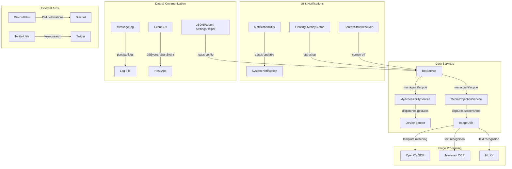

# Automation Library

    

[](https://jitpack.io/#steve1316/android-cv-automation-library)
[](https://developer.android.com/about/versions/nougat)

An Android library that provides a complete backend for computer vision-based automation on Android devices. It handles screenshot capture, image processing (via OpenCV), programmatic gesture dispatch, and integrations with external services — so you can focus on your automation logic.

## Table of Contents

- [Architecture](#architecture)
- [Features](#features)
- [Requirements](#requirements)
- [Installation](#installation)
- [Local Testing](#local-testing-before-publishing-to-jitpack)
- [Documentation](#documentation)
- [License](#license)

## Architecture



## Features

### Image Processing & Computer Vision
- **Template matching** — locate UI elements on screen using OpenCV
- **OCR** — extract text via Tesseract and Google ML Kit
- **Screenshot capture** — acquire screen images through `MediaProjectionService`
- **Screen recording** — capture video from the screen at a fixed FPS

### Gesture Automation
- **Programmatic gestures** — tap, swipe, and text input via `MyAccessibilityService`
- **Floating overlay** — draggable start/stop button managed by `BotService`
- **Screen state awareness** — `ScreenStateReceiver` gracefully stops automation when the device sleeps

### External Integrations
- **Discord** — send DM notifications via the Discord API (`DiscordUtils`)
- **Twitter** — search and post tweets via Twitter API v1.1 (`TwitterUtils`)

### Configuration & Logging
- **Settings** — load from `settings.json` (`JSONParser`) or SQLite (`SettingsHelper`)
- **Message log** — thread-safe, persistent text log (`MessageLog`)
- **Notifications** — persistent status notification with action buttons (`NotificationUtils`)
- **EventBus** — communicate between the library and your host app via `JSEvent`, `StartEvent`, and `ExceptionEvent`

## Requirements

| Requirement | Version |
|---|---|
| Android minSdk | 24 (Android 7.0) |
| Android targetSdk | 30 |
| Java | 17 |
| OpenCV Android SDK | [4.12.0](https://github.com/steve1316/opencv-android-sdk) |

## Installation

Add the JitPack repository to your project-level `build.gradle` or `settings.gradle.kts`:

```groovy
// settings.gradle.kts
dependencyResolutionManagement {
    repositories {
        maven { url = uri("https://www.jitpack.io") }
    }
}
```

Then add the dependency in your app-level `build.gradle.kts`:

```kotlin
dependencies {
    implementation("com.github.steve1316:android-cv-automation-library:<version>")
}
```

> Replace `<version>` with a release tag (e.g. `2.5.5`) or a commit hash.
> See all available versions on [JitPack](https://jitpack.io/#steve1316/android-cv-automation-library).

## Local Testing (Before Publishing to JitPack)

To test changes locally without publishing to JitPack:

**1. Set a SNAPSHOT version** in [`gradle/libs.versions.toml`](gradle/libs.versions.toml):

```toml
app-versionName = "2.5.5-SNAPSHOT"
```

> The `-SNAPSHOT` suffix tells Gradle to always pull the latest build from the local repository.

**2. Publish to Maven Local:**

```bash
./gradlew publishToMavenLocal
```

Verify the output exists in your local Maven repository at `~/.m2/repository/`.

**3. Add `mavenLocal()` to your app's repositories** (must be listed first):

```kotlin
allprojects {
    repositories {
        mavenLocal()
        maven { url = uri("https://www.jitpack.io") }
        google()
        mavenCentral()
    }
}
```

**4. Reference the SNAPSHOT version in your app:**

```kotlin
dependencies {
    implementation("com.github.steve1316:automation_library:2.5.5-SNAPSHOT")
}
```

## Documentation

See the [Wiki](../../wiki) for detailed documentation on each component in the library.

## License

This project is licensed under the [GPL 3.0 License](LICENSE).
